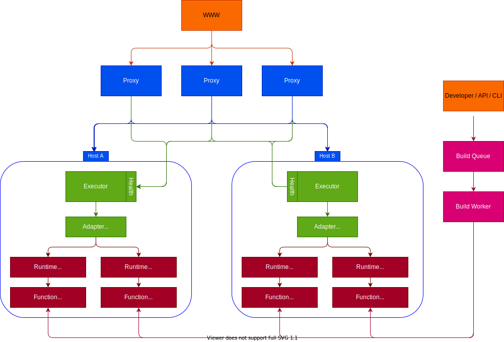

# Open Runtimes ⚡️


---

[](https://discord.gg/mkZcevnxuf)
[](https://travis-ci.com/github/open-runtimes/open-runtimes)
[](https://twitter.com/appwrite)

<!-- [](https://hub.docker.com/r/appwrite/appwrite) -->

Runtime environments for serverless cloud computing for multiple coding languages, aiming to create a consistent and predictable open standard for writing cloud functions in containerized systems.

- [Open Runtimes ⚡️](#open-runtimes-️)
  - [Features](#features)
  - [Roadmap](#roadmap)
  - [Images](#images)
  - [Architecture](#architecture)
    - [Load Balancer](#load-balancer)
    - [Executor](#executor)
    - [Adapter](#adapter)
    - [Runtime](#runtime)
    - [Function](#function)
    - [Build](#build)
  - [Structure](#structure)
  - [Testing](#testing)
  - [Contributing](#contributing)
  - [Security](#security)
  - [Follow Us](#follow-us)
  - [License](#license)

## Features

* **Flexibility** (WIP) - Designed to work with multiple orchestrators using different adapters. For now only Docker and Swarm are supported, Kubernetes support is planned.
* **Performance** - Cold starts in less than ~100ms & executions in less than 1ms.
* **Wide Support** - Supports 11 (and counting) different programming languages and 18 (and counting) different runtimes. Adding new ones is straight forward.
* **Open Source** - Released under the MIT license, free to use and extend.
* **Ecosystem** - Fast growing ecosystem of ready-to-use functions for easy reuse on different platforms.

## Roadmap

* Kubernetes Adapter - Native cloud support and easy deployment
* Official CLI - Easy deployments
* Catalog - Browse the open-runtimes functions ecosystem
* Autoscaling - Automated scaling features based on hosts and runtime metrics

## Images

| Name | Version | Docker Hub                                                                     | Examples                                     | Pulls |
| ------- |---------|--------------------------------------------------------------------------------|----------------------------------------------| ------------------------------------------------------------------------------------------------------------------------------------------------------- |
| C++ | 2017    | [openruntimes/cpp:v4-17](https://hub.docker.com/r/openruntimes/cpp)            | [Examples](/runtimes/cpp-17/example)         | [](https://hub.docker.com/r/openruntimes/cpp) |
| Dart | 2.15    | [openruntimes/dart:v4-2.15](https://hub.docker.com/r/openruntimes/dart)        | [Examples](/runtimes/dart-2.15/example)      | [](https://hub.docker.com/r/openruntimes/dart) |
| Dart | 2.16    | [openruntimes/dart:v4-2.16](https://hub.docker.com/r/openruntimes/dart)        | [Examples](/runtimes/dart-2.16/example)      | [](https://hub.docker.com/r/openruntimes/dart) |
| Dart | 2.17    | [openruntimes/dart:v4-2.17](https://hub.docker.com/r/openruntimes/dart)        | [Examples](/runtimes/dart-2.17/example)      | [](https://hub.docker.com/r/openruntimes/dart) |
| Dart | 2.18    | [openruntimes/dart:v4-2.18](https://hub.docker.com/r/openruntimes/dart)        | [Examples](/runtimes/dart-2.18/example)      | [](https://hub.docker.com/r/openruntimes/dart) |
| Dart | 2.19    | [openruntimes/dart:v4-2.19](https://hub.docker.com/r/openruntimes/dart)        | [Examples](/runtimes/dart-2.19/example)      | [](https://hub.docker.com/r/openruntimes/dart) |
| Dart | 3.0     | [openruntimes/dart:v4-3.0](https://hub.docker.com/r/openruntimes/dart)         | [Examples](/runtimes/dart-3.0/example)       | [](https://hub.docker.com/r/openruntimes/dart) |
| Dart | 3.1     | [openruntimes/dart:v4-3.1](https://hub.docker.com/r/openruntimes/dart)         | [Examples](/runtimes/dart-3.1/example)       | [](https://hub.docker.com/r/openruntimes/dart) |
| Dart | 3.3     | [openruntimes/dart:v4-3.3](https://hub.docker.com/r/openruntimes/dart)         | [Examples](/runtimes/dart-3.3/example)       | [](https://hub.docker.com/r/openruntimes/dart) |
| Dart | 3.5     | [openruntimes/dart:v4-3.5](https://hub.docker.com/r/openruntimes/dart)         | [Examples](/runtimes/dart-3.5/example)       | [](https://hub.docker.com/r/openruntimes/dart) |
| Deno | 1.21    | [openruntimes/deno:v4-1.21](https://hub.docker.com/r/openruntimes/deno)        | [Examples](/runtimes/deno-1.21/example)      | [](https://hub.docker.com/r/openruntimes/deno) |
| Deno | 1.24    | [openruntimes/deno:v4-1.24](https://hub.docker.com/r/openruntimes/deno)        | [Examples](/runtimes/deno-1.24/example)      | [](https://hub.docker.com/r/openruntimes/deno) |
| Deno | 1.35    | [openruntimes/deno:v4-1.35](https://hub.docker.com/r/openruntimes/deno)        | [Examples](/runtimes/deno-1.35/example)      | [](https://hub.docker.com/r/openruntimes/deno) |
| Deno | 1.40    | [openruntimes/deno:v4-1.40](https://hub.docker.com/r/openruntimes/deno)        | [Examples](/runtimes/deno-1.40/example)      | [](https://hub.docker.com/r/openruntimes/deno) |
| Deno | 1.46    | [openruntimes/deno:v4-1.46](https://hub.docker.com/r/openruntimes/deno)        | [Examples](/runtimes/deno-1.46/example)      | [](https://hub.docker.com/r/openruntimes/deno) |
| Deno | 2.0    | [openruntimes/deno:v4-2.0](https://hub.docker.com/r/openruntimes/deno)        | [Examples](/runtimes/deno-2.0/example) | [](https://hub.docker.com/r/openruntimes/deno) |
| .NET | 6.0     | [openruntimes/dotnet:v4-6.0](https://hub.docker.com/r/openruntimes/dotnet)     | [Examples](/runtimes/dotnet-6.0/example)     | [](https://hub.docker.com/r/openruntimes/dotnet) |
| .NET | 7.0     | [openruntimes/dotnet:v4-7.0](https://hub.docker.com/r/openruntimes/dotnet)     | [Examples](/runtimes/dotnet-7.0/example)     | [](https://hub.docker.com/r/openruntimes/dotnet) |
| Java | 8       | [openruntimes/java:v4-8.0](https://hub.docker.com/r/openruntimes/java)         | [Examples](/runtimes/java-8.0/example)       | [](https://hub.docker.com/r/openruntimes/java) |
| Java | 11      | [openruntimes/java:v4-11.0](https://hub.docker.com/r/openruntimes/java)        | [Examples](/runtimes/java-11.0/example)      | [](https://hub.docker.com/r/openruntimes/java) |
| Java | 17      | [openruntimes/java:v4-17.0](https://hub.docker.com/r/openruntimes/java)        | [Examples](/runtimes/java-17.0/example)      | [](https://hub.docker.com/r/openruntimes/java) |
| Java | 18      | [openruntimes/java:v4-18.0](https://hub.docker.com/r/openruntimes/java)        | [Examples](/runtimes/java-18.0/example)      | [](https://hub.docker.com/r/openruntimes/java) |
| Java | 20      | [openruntimes/java:v4-20.0](https://hub.docker.com/r/openruntimes/java)        | [Examples](/runtimes/java-20.0/example)      | [](https://hub.docker.com/r/openruntimes/java) |
| Java | 21      | [openruntimes/java:v4-21.0](https://hub.docker.com/r/openruntimes/java)        | [Examples](/runtimes/java-21.0/example)      | [](https://hub.docker.com/r/openruntimes/java) |
| Java | 22      | [openruntimes/java:v4-22](https://hub.docker.com/r/openruntimes/java)        | [Examples](/runtimes/java-22/example)      | [](https://hub.docker.com/r/openruntimes/java) |
| Kotlin | 1.6     | [openruntimes/kotlin:v4-1.6](https://hub.docker.com/r/openruntimes/kotlin)     | [Examples](/runtimes/kotlin-1.6/example)     | [](https://hub.docker.com/r/openruntimes/kotlin) |
| Kotlin | 1.8     | [openruntimes/kotlin:v4-1.8](https://hub.docker.com/r/openruntimes/kotlin)     | [Examples](/runtimes/kotlin-1.8/example)     | [](https://hub.docker.com/r/openruntimes/kotlin) |
| Kotlin | 1.9     | [openruntimes/kotlin:v4-1.9](https://hub.docker.com/r/openruntimes/kotlin)     | [Examples](/runtimes/kotlin-1.9/example)     | [](https://hub.docker.com/r/openruntimes/kotlin) |
| Kotlin | 2.0     | [openruntimes/kotlin:v4-2.0](https://hub.docker.com/r/openruntimes/kotlin)     | [Examples](/runtimes/kotlin-2.0/example)     | [](https://hub.docker.com/r/openruntimes/kotlin) |
| Go | 1.23    | [openruntimes/go:v4-1.23](https://hub.docker.com/r/openruntimes/go)            | [Examples](/runtimes/go-1.23/example)        | [](https://hub.docker.com/r/openruntimes/go) |
| Node.js | 14.5    | [openruntimes/node:v4-14.5](https://hub.docker.com/r/openruntimes/node)        | [Examples](/runtimes/node-14.5/example)      | [](https://hub.docker.com/r/openruntimes/node) |
| Node.js | 16.0    | [openruntimes/node:v4-16.0](https://hub.docker.com/r/openruntimes/node)        | [Examples](/runtimes/node-16.0/example)      | [](https://hub.docker.com/r/openruntimes/node) |
| Node.js | 18.0    | [openruntimes/node:v4-18.0](https://hub.docker.com/r/openruntimes/node)        | [Examples](/runtimes/node-18.0/example)      | [](https://hub.docker.com/r/openruntimes/node) |
| Node.js | 19.0    | [openruntimes/node:v4-19.0](https://hub.docker.com/r/openruntimes/node)        | [Examples](/runtimes/node-19.0/example)      | [](https://hub.docker.com/r/openruntimes/node) |
| Node.js | 20.0    | [openruntimes/node:v4-20.0](https://hub.docker.com/r/openruntimes/node)        | [Examples](/runtimes/node-20.0/example)      | [](https://hub.docker.com/r/openruntimes/node) |
| Node.js | 21.0    | [openruntimes/node:v4-21.0](https://hub.docker.com/r/openruntimes/node)        | [Examples](/runtimes/node-21.0/example)      | [](https://hub.docker.com/r/openruntimes/node) |
| Node.js | 22    | [openruntimes/node:v4-22](https://hub.docker.com/r/openruntimes/node)        | [Examples](/runtimes/node-22/example)      | [](https://hub.docker.com/r/openruntimes/node) |
| PHP | 8.0     | [openruntimes/php:v4-8.0](https://hub.docker.com/r/openruntimes/php)           | [Examples](/runtimes/php-8.0/example)        | [](https://hub.docker.com/r/openruntimes/php) |
| PHP | 8.1     | [openruntimes/php:v4-8.1](https://hub.docker.com/r/openruntimes/php)           | [Examples](/runtimes/php-8.1/example)        | [](https://hub.docker.com/r/openruntimes/php) |
| PHP | 8.2     | [openruntimes/php:v4-8.2](https://hub.docker.com/r/openruntimes/php)           | [Examples](/runtimes/php-8.2/example)        | [](https://hub.docker.com/r/openruntimes/php) |
| PHP | 8.3     | [openruntimes/php:v4-8.3](https://hub.docker.com/r/openruntimes/php)           | [Examples](/runtimes/php-8.3/example)        | [](https://hub.docker.com/r/openruntimes/php) |
| Python | 3.8     | [openruntimes/python:v4-3.8](https://hub.docker.com/r/openruntimes/python)     | [Examples](/runtimes/python-3.8/example)     | [](https://hub.docker.com/r/openruntimes/python) |
| Python | 3.9     | [openruntimes/python:v4-3.9](https://hub.docker.com/r/openruntimes/python)     | [Examples](/runtimes/python-3.9/example)     | [](https://hub.docker.com/r/openruntimes/python) |
| Python | 3.10    | [openruntimes/python:v4-3.10](https://hub.docker.com/r/openruntimes/python)    | [Examples](/runtimes/python-3.10/example)    | [](https://hub.docker.com/r/openruntimes/python) |
| Python | 3.11    | [openruntimes/python:v4-3.11](https://hub.docker.com/r/openruntimes/python)    | [Examples](/runtimes/python-3.11/example)    | [](https://hub.docker.com/r/openruntimes/python) |
| Python | 3.12    | [openruntimes/python:v4-3.12](https://hub.docker.com/r/openruntimes/python)    | [Examples](/runtimes/python-3.12/example)    | [](https://hub.docker.com/r/openruntimes/python) |
| Python ML | 3.11    | [openruntimes/python-ml:v4-3.11](https://hub.docker.com/r/openruntimes/python) | [Examples](/runtimes/python-ml-3.11/example) | [](https://hub.docker.com/r/openruntimes/python-ml) |
| Python ML | 3.12    | [openruntimes/python-ml:v4-3.12](https://hub.docker.com/r/openruntimes/python) | [Examples](/runtimes/python-ml-3.12/example) | [](https://hub.docker.com/r/openruntimes/python-ml) |
| Ruby | 3.0     | [openruntimes/ruby:v4-3.0](https://hub.docker.com/r/openruntimes/ruby)         | [Examples](/runtimes/ruby-3.0/example)       | [](https://hub.docker.com/r/openruntimes/ruby) |
| Ruby | 3.1     | [openruntimes/ruby:v4-3.1](https://hub.docker.com/r/openruntimes/ruby)         | [Examples](/runtimes/ruby-3.1/example)       | [](https://hub.docker.com/r/openruntimes/ruby) |
| Ruby | 3.2     | [openruntimes/ruby:v4-3.2](https://hub.docker.com/r/openruntimes/ruby)         | [Examples](/runtimes/ruby-3.2/example)       | [](https://hub.docker.com/r/openruntimes/ruby) |
| Ruby | 3.3     | [openruntimes/ruby:v4-3.3](https://hub.docker.com/r/openruntimes/ruby)         | [Examples](/runtimes/ruby-3.3/example)       | [](https://hub.docker.com/r/openruntimes/ruby) |
| Swift | 5.5     | [openruntimes/swift:v4-5.5](https://hub.docker.com/r/openruntimes/swift)       | [Examples](/runtimes/swift-5.5/example)      | [](https://hub.docker.com/r/openruntimes/swift) |
| Swift | 5.8     | [openruntimes/swift:v4-5.8](https://hub.docker.com/r/openruntimes/swift)       | [Examples](/runtimes/swift-5.8/example)      | [](https://hub.docker.com/r/openruntimes/swift) |
| Swift | 5.9     | [openruntimes/swift:v4-5.9](https://hub.docker.com/r/openruntimes/swift)       | [Examples](/runtimes/swift-5.9/example)      | [](https://hub.docker.com/r/openruntimes/swift) |
| Swift | 5.10    | [openruntimes/swift:v4-5.10](https://hub.docker.com/r/openruntimes/swift)      | [Examples](/runtimes/swift-5.10/example)     | [](https://hub.docker.com/r/openruntimes/swift) |
| Bun | 1.0     | [openruntimes/bun:v4-1.0](https://hub.docker.com/r/openruntimes/bun)           | [Examples](/runtimes/bun-1.0/example)        | [](https://hub.docker.com/r/openruntimes/bun) |
| Bun | 1.1     | [openruntimes/bun:v4-1.1](https://hub.docker.com/r/openruntimes/bun)           | [Examples](/runtimes/bun-1.0/example)        | [](https://hub.docker.com/r/openruntimes/bun) |

## Architecture



### Load Balancer

The Load Balancer get requests for endpoints and responsible for balancing and scaling the requests between multiple hosts where runtime executors are available. This is the layer where you want to implement auto-scaling and keep track of which host has which runtimes available to allow wise spending of computing resources.

### Executor

The Executor is responsible for starting runtimes (AKA cold starts), and directing requests, environment variables, and user inputs to each runtime. In addition, the Executor will also be responsible for managing timeouts, max runtime allowed in parallel, and cleanup of inactive runtimes in the chosen interval.

### Adapter

The Adapter is a software layer component that interacts with the container orchestration engine to manage the compute runtimes.

### Runtime

The Runtime is a containerized isolated environment to run user-provided code. The runtime is spinning an HTTP TCP server on startup from one of the supported languages and handles requests on demand. Multiple runtimes of the same function can potentially run on the same or multiple hosts.

### Function

The Functions is a user provider packaged of code that is mounted to each Runtime and is executed inside the isolated environment. The package code should already be compiled and provided with all required dependencies.

### Build

The Build is composed from a queue and set of workers, the build process receives the raw codebase from the filesystem or a VCS and compiles or packages it with all dependencies. The build help with providing the dev's Function as a ready-to-execute codebase for the Runtime.

## Structure

All runtimes share a common basic structure, but each additionally adds runtime-specific files to properly support it's package manager.

```
.
├── src
│   ├── (runtime-specific, like index.js)
├── example
│   ├── (runtime-specific, like server.js)
├── helpers
│   ├── after-build.sh
│   ├── before-build.sh
│   ├── before-start.sh
│   ├── build.sh
│   └── start.sh
├── docker-compose.yml
├── Dockerfile
├── README.md
└── (runtime-specific, like package.json)
```


| Name               	| Description                                                                                                                                           	|
|--------------------	|-------------------------------------------------------------------------------------------------------------------------------------------------------	|
| src/           	    | Contains source code of HTTP server of the runtime server                                                                                               	|
| example/           	| Contains a sample function to demonstrate the usage of the runtime server                                                                             	|
| helpers/           	| Contains bash scripts that helps with simple build and start process. Can be ignored for more complex solution.                                          	|
| docker-compose.yml 	| Configuration to easily run the example code with `docker-compose up`                                                                                 	|
| Dockerfile         	| Instructions to build a runtime, install it's dependencies and setup the runtime server. These images are usually based on official alpine or ubuntu. 	|
| README.md          	| Runtime specific documentation                                                                                                                        	|

Structure of `helpers/` directory follows:

| Name               	| Description                                                                                                                                           	|
|--------------------	|-------------------------------------------------------------------------------------------------------------------------------------------------------	|
| before-build.sh       | Mirroring of function code from mount directory to build directiry. Do changes inside build directory if needed.                                          |
| after-build.sh       	| Append .open-runtimes file, gzip file, and store into mount directory. Do post-build changes to build output if needed.                                  	|
| build.sh           	| Shortcut combining `before-build.sh`, your custom build command (like `npm install`), and `after-build.sh`.                                          	    |
| before-start.sh 	    | Extracting of function build from mount directory into server's directory. Do changes to server directory if needed.                                      |
| start.sh         	    | Shortcut combining `before-start.sh` and your custom start command (like `npm start`)                                                                     |

Every request sent to any of the runtimes must have the `x-open-runtimes-secret` header. The value of this header has to match the value of environment variable `OPEN_RUNTIMES_SECRET` set on the runtime. All example scripts use `secret-key` as the key and we strongly recommend changing this key before production use.

## Contributing

All code contributions - including those of people having commit access - must go through a pull request and be approved by a core developer before being merged. This is to ensure a proper review of all the code.

We truly ❤️ pull requests! If you wish to help, you can learn more about how you can contribute to this project in the [contribution guide](CONTRIBUTING.md).

## Security

For security issues, kindly email us at [security@appwrite.io](mailto:security@appwrite.io) instead of posting a public issue on GitHub.

## Follow Us

Join our growing community around the world! See our official [Blog](https://medium.com/appwrite-io). Follow us on [Twitter](https://twitter.com/appwrite), [Facebook Page](https://www.facebook.com/appwrite.io), [Facebook Group](https://www.facebook.com/groups/appwrite.developers/) , [Dev Community](https://dev.to/appwrite) or join our live [Discord server](https://discord.gg/mkZcevnxuf) for more help, ideas, and discussions.

## License

This repository is available under the [MIT License](./LICENSE).
