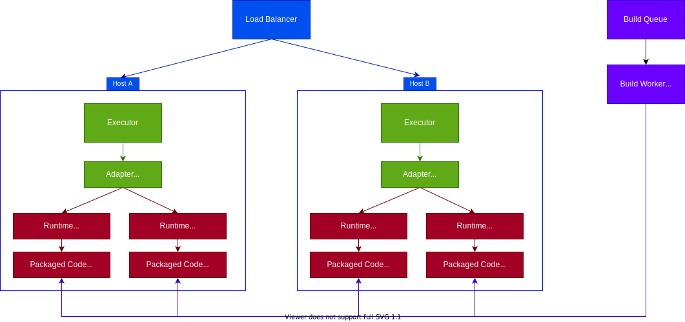

# Open Runtimes

---

<!--  -->

Runtime environments for serverless cloud computing for multiple coding languages, aiming to create a consistent and predictable open standard for writing cloud functions in containerized systems.

## Images

| Name    | Version | Docker Hub                 | Pulls |
|---------|---------|----------------------------|-------|
| Node.js | 15.0    | [open-runtimes/node.js:15.0](https://hub.docker.com/r/open-runtimes/node.js) |  |
| Node.js | 16.0    | [open-runtimes/node.js:16.0](https://hub.docker.com/r/open-runtimes/node.js) |  |
| PHP     | 8.0     | [open-runtimes/php:8.0](https://hub.docker.com/r/open-runtimes/php)      |  |

## Architecture

