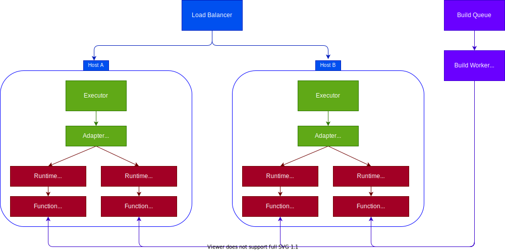

# Open Runtimes ⚡️


---

[](https://discord.gg/mkZcevnxuf)
[](https://travis-ci.com/github/open-runtimes/open-runtimes)
[](https://twitter.com/appwrite)

<!-- [](https://hub.docker.com/r/appwrite/appwrite) -->

Runtime environments for serverless cloud computing for multiple coding languages, aiming to create a consistent and predictable open standard for writing cloud functions in containerized systems.

- [Open Runtimes ⚡️](#open-runtimes-️)
  - [Features](#features)
  - [Roadmap](#roadmap)
  - [Images](#images)
  - [Architecture](#architecture)
    - [Load Balancer](#load-balancer)
    - [Executor](#executor)
    - [Adapter](#adapter)
    - [Runtime](#runtime)
    - [Function](#function)
    - [Build](#build)
  - [Structure](#structure)
  - [Testing](#testing)
  - [Contributing](#contributing)
  - [Security](#security)
  - [Follow Us](#follow-us)
  - [License](#license)

## Features

* **Flexibility** (WIP) - Designed to work with multiple orchestrators using different adapters. For now only Docker and Swarm are supported, Kubernetes support is planned.
* **Performance** - Cold starts in less than ~100ms warm stars has added latency of less than 1ms.
* **Wide Support** - Supports 6 (and counting) different coding languages and 18 (and counting) different runtimes. Adding new ones is straight forward.
* **Open Source** - Released under the MIT license, free to use and extend.
* **Ecosystem** - Fast growing ecosystem of ready-to-use functions for easy reuse on different platforms.

## Roadmap

* Kubernetes Adapter - Native cloud support and easy deployment
* Official CLI - Easy deployments
* Catalog - Browse the open-runtimes functions ecosystem
* Autoscaling - Automated scaling features based on hosts and runtime metrics

## Images

| Name    | Version | Docker Hub                 | Examples | Pulls |
|---------|---------|----------------------------|----------|-------|
| Node.js | 17.0    | [openruntimes/node:17.0](https://hub.docker.com/r/openruntimes/node) | [Examples](/runtimes/node-17.0/example) | [](https://hub.docker.com/r/openruntimes/node) |
| Node.js | 16.0    | [openruntimes/node:16.0](https://hub.docker.com/r/openruntimes/node) | [Examples](/runtimes/node-16.0/example) | [](https://hub.docker.com/r/openruntimes/node) |
| Node.js | 15.5    | [openruntimes/node:15.5](https://hub.docker.com/r/openruntimes/node) | [Examples](/runtimes/node-15.5/example) | [](https://hub.docker.com/r/openruntimes/node) |
| Node.js | 14.5    | [openruntimes/node:14.5](https://hub.docker.com/r/openruntimes/node) | [Examples](/runtimes/node-14.5/example) | [](https://hub.docker.com/r/openruntimes/node) |
| Python | 3.10    | [openruntimes/python:3.10](https://hub.docker.com/r/openruntimes/python) | [Examples](/runtimes/python-3.10/example) | [](https://hub.docker.com/r/openruntimes/python) |
| Python | 3.9    | [openruntimes/python:3.9](https://hub.docker.com/r/openruntimes/python) | [Examples](/runtimes/python-3.9/example) | [](https://hub.docker.com/r/openruntimes/python) |
| Python | 3.8    | [openruntimes/python:3.8](https://hub.docker.com/r/openruntimes/python) | [Examples](/runtimes/python-3.8/example) | [](https://hub.docker.com/r/openruntimes/python) |
| Ruby | 3.1    | [openruntimes/ruby:3.1](https://hub.docker.com/r/openruntimes/ruby) | [Examples](/runtimes/ruby-3.1/example) | [](https://hub.docker.com/r/openruntimes/ruby) |
| Ruby | 3.0    | [openruntimes/ruby:3.0](https://hub.docker.com/r/openruntimes/ruby) | [Examples](/runtimes/ruby-3.0/example) | [](https://hub.docker.com/r/openruntimes/ruby) |
| PHP | 8.1    | [openruntimes/php:8.1](https://hub.docker.com/r/openruntimes/php) | [Examples](/runtimes/php-8.1/example) | [](https://hub.docker.com/r/openruntimes/php) |
| PHP | 8.0    | [openruntimes/php:8.0](https://hub.docker.com/r/openruntimes/php) | [Examples](/runtimes/php-8.0/example) | [](https://hub.docker.com/r/openruntimes/php) |
| Dart | 2.16    | [openruntimes/dart:2.16](https://hub.docker.com/r/openruntimes/dart) | [Examples](/runtimes/dart-2.16/example) | [](https://hub.docker.com/r/openruntimes/dart) |
| Dart | 2.15    | [openruntimes/dart:2.15](https://hub.docker.com/r/openruntimes/dart) | [Examples](/runtimes/dart-2.15/example) | [](https://hub.docker.com/r/openruntimes/dart) |
| Dart | 2.14    | [openruntimes/dart:2.14](https://hub.docker.com/r/openruntimes/dart) | [Examples](/runtimes/dart-2.14/example) | [](https://hub.docker.com/r/openruntimes/dart) |
| Dart | 2.13    | [openruntimes/dart:2.13](https://hub.docker.com/r/openruntimes/dart) | [Examples](/runtimes/dart-2.13/example) | [](https://hub.docker.com/r/openruntimes/dart) |
| Dart | 2.12    | [openruntimes/dart:2.12](https://hub.docker.com/r/openruntimes/dart) | [Examples](/runtimes/dart-2.12/example) | [](https://hub.docker.com/r/openruntimes/dart) |
| Deno | 1.14    | [openruntimes/deno:1.14](https://hub.docker.com/r/openruntimes/deno) | [Examples](/runtimes/deno-1.14/example) | [](https://hub.docker.com/r/openruntimes/deno) |
| Deno | 1.13    | [openruntimes/deno:1.13](https://hub.docker.com/r/openruntimes/deno) | [Examples](/runtimes/deno-1.13/example) | [](https://hub.docker.com/r/openruntimes/deno) |
| Deno | 1.12    | [openruntimes/deno:1.12](https://hub.docker.com/r/openruntimes/deno) | [Examples](/runtimes/deno-1.12/example) | [](https://hub.docker.com/r/openruntimes/deno) |
| Kotlin | 1.6    | [openruntimes/kotlin:1.6](https://hub.docker.com/r/openruntimes/kotlin) | [Examples](/runtimes/kotlin-1.6/example) | [](https://hub.docker.com/r/openruntimes/kotlin) |
| Java | 8    | [openruntimes/java:8.0](https://hub.docker.com/r/openruntimes/java) | [Examples](/runtimes/java-8.0/example) | [](https://hub.docker.com/r/openruntimes/java) |
| Java | 11   | [openruntimes/java:11.0](https://hub.docker.com/r/openruntimes/java) | [Examples](/runtimes/java-11.0/example) | [](https://hub.docker.com/r/openruntimes/java) |
| Java | 17    | [openruntimes/java:17.0](https://hub.docker.com/r/openruntimes/java) | [Examples](/runtimes/java-17.0/example) | [](https://hub.docker.com/r/openruntimes/java) |
| Swift | 5.5    | [openruntimes/swift:5.5](https://hub.docker.com/r/openruntimes/swift) | [Examples](/runtimes/swift-5.5/example) | [](https://hub.docker.com/r/openruntimes/swift) |
| .NET | 3.1    | [openruntimes/dotnet:3.1](https://hub.docker.com/r/openruntimes/dotnet) | [Examples](/runtimes/dotnet-3.1/example) | [](https://hub.docker.com/r/openruntimes/dotnet) |
| .NET | 6.0    | [openruntimes/dotnet:6.0](https://hub.docker.com/r/openruntimes/dotnet) | [Examples](/runtimes/dotnet-6.0/example) | [](https://hub.docker.com/r/openruntimes/dotnet) |
| C++ | 2017    | [openruntimes/cpp:17](https://hub.docker.com/r/openruntimes/cpp) | [Examples](/runtimes/cpp-17/example) | [](https://hub.docker.com/r/openruntimes/cpp) |

## Architecture



### Load Balancer

The Load Balancer get requests for endpoints and responsible for balancing and scaling the requests between multiple hosts where runtime executors are available. This is the layer where you want to implement auto-scaling and keep track of which host has which runtimes available to allow wise spending of computing resources.

### Executor

The Executor is responsible for starting runtimes (AKA cold starts), and directing requests, environment variables, and user inputs to each runtime. In addition, the Executor will also be responsible for managing timeouts, max runtime allowed in parallel, and cleanup of inactive runtimes in the chosen interval.

### Adapter

The Adapter is a software layer component that interacts with the container orchestration engine to manage the compute runtimes.

### Runtime

The Runtime is a containerized isolated environment to run user-provided code. The runtime is spinning an HTTP TCP server on startup from one of the supported languages and handles requests on demand. Multiple runtimes of the same function can potentially run on the same or multiple hosts.

### Function

The Functions is a user provider packaged of code that is mounted to each Runtime and is executed inside the isolated environment. The package code should already be compiled and provided with all required dependencies.

### Build

The Build is composed from a queue and set of workers, the build process receives the raw codebase from the filesystem or a VCS and compiles or packages it with all dependencies. The build help with providing the dev's Function as a ready-to-execute codebase for the Runtime.

## Structure

All runtimes share a common basic structure, but each additionally adds runtime-specific files to properly support it's package manager.

```
.
├── build.sh
├── docker-compose.yml
├── Dockerfile
├── example
│   ├── (runtime-specific)
├── start.sh
├── README.md
└── server.X
```

| Name               	| Description                                                                                                                                           	|
|--------------------	|-------------------------------------------------------------------------------------------------------------------------------------------------------	|
| example/           	| Contains a sample function to demonstrate the usage of the runtime server                                                                             	|
| docker-compose.yml 	| Configuration to easily run the example code with `docker-compose up`                                                                                 	|
| Dockerfile         	| Instructions to build a runtime, install it's dependencies and setup the runtime server. These images are usually based on official alpine or ubuntu. 	|
| server.X           	| A HTTP server implemented in the respective runtime's language. File extension depends on your runtime. For instance, Python is `server.py`           	|
| build.sh           	| Script responsible for building user code. This can be package installations, or any specific build process the runtime requires.                     	|
| start.sh          	| Script to launch the HTTP server on port `3000`. Additionally, it also copies the user supplied code to a directory accessible to the server.         	|
| prepare.X          | (optional) If a runtime requires preparation before building (for instance PHP), this file holds the logic for mapping the files.                     	|
| README.md          	| Runtime specific documentation                                                                                                                        	|

Every request sent to any of the runtimes must have the `X-Internal-Challenge` header. The value of this header has to match the value of environment variable `INTERNAL_RUNTIME_KEY` set on the runtime. All example scripts use `secret-key` as the key and we strongly recommend changing this key before production use.

All requests should also have JSON body with the following structure:

```json5
{
    // Following will be exposed to the function
    "variables": {
        // Function variables
    },
    "payload": "{}",
    "headers": {
        // Request headers
    }
}
```

All body parameters are optional. The values used in the example above are the default values.

## Testing

We use PHP framework PHPUnit to test Open Runtimes. Every PR is automatically tested by Travis CI, and tests run for all runtimes.

Before running the tests, make sure to install all required PHP libraries:

```bash
docker run --rm --interactive --tty --volume $PWD:/app composer install
```

Once ready, you can test runtimes. First, you need to pick which runtime you want to test. In this example you will be testing `node-17.0` runtime. You can test any runtime; make sure to get runtime name, php class name, and entrypoint from a runtime-related test in PHP file in `tests` directory.

To run tests, you execute `tests.sh` while providing information about runtime you want to test:

```bash
RUNTIME='node-17.0' PHP_CLASS='Node170' ENTRYPOINT='tests.js' sh tests.sh
```

## Contributing

All code contributions - including those of people having commit access - must go through a pull request and be approved by a core developer before being merged. This is to ensure a proper review of all the code.

We truly ❤️ pull requests! If you wish to help, you can learn more about how you can contribute to this project in the [contribution guide](CONTRIBUTING.md).

## Security

For security issues, kindly email us at [security@appwrite.io](mailto:security@appwrite.io) instead of posting a public issue on GitHub.

## Follow Us

Join our growing community around the world! See our official [Blog](https://medium.com/appwrite-io). Follow us on [Twitter](https://twitter.com/appwrite), [Facebook Page](https://www.facebook.com/appwrite.io), [Facebook Group](https://www.facebook.com/groups/appwrite.developers/) , [Dev Community](https://dev.to/appwrite) or join our live [Discord server](https://discord.gg/mkZcevnxuf) for more help, ideas, and discussions.

## License

This repository is available under the [MIT License](./LICENSE).
